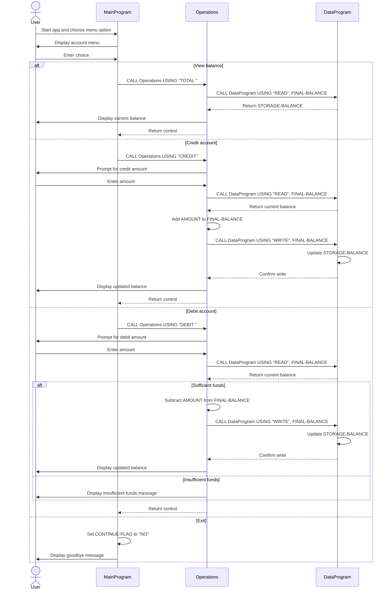

# COBOL Student Account Documentation

This directory documents the COBOL programs under `src/cobol`.

The current implementation models a simple student account balance workflow with three supported actions:

- View the current account balance
- Credit the account
- Debit the account

## File Overview

### `main.cob`

Program ID: `MainProgram`

Purpose:

- Serves as the entry point for the application
- Displays the account management menu
- Accepts user input and routes the request to the operations program
- Keeps the application running until the user chooses to exit

Key logic:

- `MAIN-LOGIC` runs in a loop while `CONTINUE-FLAG` is `YES`
- Menu choice `1` calls `Operations` with `TOTAL ` to view the balance
- Menu choice `2` calls `Operations` with `CREDIT` to add funds
- Menu choice `3` calls `Operations` with `DEBIT ` to remove funds
- Menu choice `4` ends the loop and exits the program
- Any other input shows an invalid-choice message

### `operations.cob`

Program ID: `Operations`

Purpose:

- Contains the business behavior for balance lookup, credit, and debit transactions
- Acts as the service layer between the menu program and the data storage program

Key logic:

- Receives a 6-character operation code through the linkage section
- For `TOTAL `:
  - Calls `DataProgram` with `READ`
  - Displays the current balance
- For `CREDIT`:
  - Prompts for an amount
  - Reads the current balance from `DataProgram`
  - Adds the entered amount to the balance
  - Writes the updated balance back through `DataProgram`
  - Displays the new balance
- For `DEBIT `:
  - Prompts for an amount
  - Reads the current balance from `DataProgram`
  - Subtracts the amount only if enough funds are available
  - Writes the updated balance back through `DataProgram`
  - Displays either the new balance or an insufficient-funds message

### `data.cob`

Program ID: `DataProgram`

Purpose:

- Maintains the stored balance value used by the rest of the application
- Provides a minimal read/write interface for account balance access

Key logic:

- Stores the balance in `STORAGE-BALANCE`
- Accepts an operation code and balance field through the linkage section
- For `READ`, copies `STORAGE-BALANCE` into the passed balance field
- For `WRITE`, copies the passed balance field into `STORAGE-BALANCE`

## Student Account Business Rules

The code currently implements these business rules for student accounts:

- A single account balance is managed for the running program session
- The starting balance is `1000.00`
- Monetary values use two decimal places through `PIC 9(6)V99`
- Credits always increase the stored balance by the entered amount
- Debits are allowed only when the current balance is greater than or equal to the requested amount
- If a debit would overdraw the account, the transaction is rejected and the balance remains unchanged
- The balance is read before each transaction and written back only after a successful update
- Supported command codes are fixed-width 6-character values: `TOTAL `, `CREDIT`, `DEBIT `, `READ`, and `WRITE`

## Notes and Current Limitations

- The application stores only one balance and does not track student IDs or multiple accounts
- There is no validation to prevent zero or negative credit/debit amounts
- The balance is maintained in program storage and is not persisted to an external file or database
- Account history, audit logging, and transaction timestamps are not implemented

## Program Flow Summary

1. `MainProgram` displays the menu and accepts a user action.
2. `MainProgram` calls `Operations` with the selected operation code.
3. `Operations` reads or updates the balance through `DataProgram`.
4. `DataProgram` returns the current balance or stores the new one.
5. Control returns to `MainProgram` for the next action.

## Sequence Diagram

